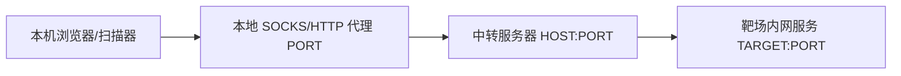

# 05. 内网隧道 & 代理穿透

> 写作原则：本章按图中第 5 个板块整理，面向授权靶场、CTF、本地样本、企业自查与防守检测。隧道和代理既是运维技术，也是攻击者常用隐蔽通道；本章讲清概念、边界、证据和检测，不把工具当“黑盒神器”。

## 1. 这个板块到底在干什么？

大白话：很多内网服务不直接暴露在外网。隧道和代理就是在两段网络之间搭一条“转发通道”，让测试流量能从一个入口转到另一个网络位置。

合法场景：

- 远程运维；
- 内网靶场访问；
- 云服务器反向代理；
- 安全测试中的受控流量转发；
- 企业零信任/堡垒机/代理审计。

风险场景：

- 攻击者把内网流量通过 WebShell 或代理转出来；
- 恶意程序使用代理隐藏真实 C2；
- 源站只做内网限制，但被隧道带出访问能力；
- 日志只看到代理节点，看不到真实操作来源。

MITRE ATT&CK 把 Proxy（T1090）和 Protocol Tunneling（T1572）作为攻击者常用技术。[^mitre-t1090][^mitre-t1572]

---

## 2. 图中第 5 板块拆解

| 图中分类 | 图中工具/关键词 | 入门者理解 |
|---|---|---|
| 反向内网穿透 | frp | 内网机器主动连外部服务器，外部再通过服务器转进来。 |
| HTTP 隧道搭建（WebShell 隧道代理） | Neo-reGeorg、suo5 | 借助 HTTP/WebShell 通道承载 SOCKS/转发流量。 |
| 全局流量代理 | clash、proxifier | 让本机应用流量走指定代理，便于访问靶场网段或统一审计。 |

---

## 3. 基础概念：代理、转发、隧道别混淆

| 概念 | 大白话 | 典型例子 |
|---|---|---|
| 正向代理 | 你让代理帮你访问外部网站。 | 浏览器设置 HTTP/SOCKS 代理。 |
| 反向代理 | 外部访问代理，代理再转给后端服务。 | Nginx 代理到内网应用。 |
| 端口转发 | 把一个端口收到的流量转到另一个地址端口。 | `LOCAL:PORT → TARGET:PORT`。 |
| SOCKS 代理 | 通用代理协议，能转多种 TCP 连接。 | 浏览器/扫描器走 SOCKS5。 |
| HTTP 隧道 | 把其他协议包在 HTTP 里传。 | WebShell 隧道、CONNECT 隧道。 |
| 反向隧道 | 内网端主动向外连，外部通过该连接访问内网。 | frp、反向 SSH。 |

记忆方式：

```text
代理：谁帮谁访问。
转发：哪个端口转到哪个端口。
隧道：把一种流量包在另一种流量里面走。
```

---

## 4. 反向内网穿透：frp

### 4.1 可核验事实

frp 官方 GitHub README 说明它是 fast reverse proxy，可帮助把 NAT 或防火墙后的本地服务器暴露到互联网，支持 TCP、UDP、HTTP、HTTPS 等。[^frp]

### 4.2 大白话理解

如果你的靶场机器在内网，外面访问不到它。frp 的基本思路是：

```text
内网客户端主动连公网服务端 → 公网服务端开一个入口 → 访问入口的流量被转给内网客户端
```

这在运维上很常见，但在安全事件里也常被用作隐蔽通道。

### 4.3 安全测试记录要点

| 字段 | 说明 |
|---|---|
| server | 外部中转服务器地址，写 `HOST` 占位即可。 |
| client | 内网靶场机器标识。 |
| local_port | 被转发的本地服务端口。 |
| remote_port | 外部暴露端口。 |
| protocol | TCP/UDP/HTTP/HTTPS。 |
| auth | 是否启用 token、TLS、访问控制。 |
| logs | 服务端和客户端连接日志。 |

### 4.4 防守关注点

- 内网主机异常长连接到未知 VPS；
- 非运维机器运行 frpc/frps 类进程名；
- 出站连接端口和协议异常；
- 同一连接承载多种内网访问行为；
- 代理服务器日志缺失或未纳入审计。

---

## 5. HTTP 隧道：Neo-reGeorg 与 suo5

### 5.1 可核验工具事实

| 工具 | 可核验事实 | 来源 |
|---|---|---|
| Neo-reGeorg | GitHub 项目说明其目标是主动重构 reGeorg，增强连接安全性和可用性，常用于 HTTP 隧道/SOCKS 代理场景。 | [L-codes/Neo-reGeorg](https://github.com/L-codes/Neo-reGeorg) |
| suo5 | GitHub 项目说明 suo5 是高性能 HTTP 代理隧道，使用 WebSocket 承载通信。 | [zema1/suo5](https://github.com/zema1/suo5) |

### 5.2 大白话理解

HTTP 隧道像“把小车装进货车过检查站”：外面看是 HTTP 请求，里面承载的是代理流量。

常见结构：

```text
浏览器/扫描器 → 本地 SOCKS 端口 → 隧道客户端 → HTTP 请求 → Web 端脚本/服务 → 内网目标
```

### 5.3 防守检测重点

| 线索 | 说明 |
|---|---|
| 某 Web 路径长时间大量 POST | 隧道持续传输。 |
| 请求体/响应体高熵且大小接近 | 可能承载加密代理数据。 |
| 同一 Web 入口访问多个内网 IP/端口 | 可能被当作跳板。 |
| Web 服务器出站连接异常 | WebShell/隧道在访问内网或外部。 |
| User-Agent 固定且非业务客户端 | 自动化隧道特征。 |

### 5.4 报告证据模板

```markdown
## HTTP Tunnel Suspicion

- Web 入口：https://HOST/PATH
- 时间范围：START - END
- 请求特征：METHOD、Content-Length 范围、User-Agent
- 后端行为：Web 进程连接 TARGET:PORT
- 日志证据：access.log、EDR、netflow
- 结论：suspected / observed / negated
```

---

## 6. 全局流量代理：clash 与 proxifier

### 6.1 可核验工具事实

| 工具 | 可核验事实 | 来源 |
|---|---|---|
| Clash | Clash 是一个基于规则的跨平台代理核心；原 GitHub 项目已归档，生态分支较多，使用前要核对来源。 | [Dreamacro/clash](https://github.com/Dreamacro/clash) |
| Proxifier | Proxifier 官方说明其可让不支持代理的网络应用通过 SOCKS 或 HTTPS 代理工作。 | [Proxifier 官方](https://www.proxifier.com/) |

### 6.2 大白话理解

有些工具自带代理设置，有些没有。全局代理工具可以把本机某些应用的流量“接管”后发到代理上。

用途：

- 让浏览器、扫描器、命令行工具统一走靶场代理；
- 把所有访问纳入抓包审计；
- 让不支持 SOCKS 的工具也能走代理；
- 在多网段靶场里按规则分流。

### 6.3 新手最容易踩的坑

| 坑 | 结果 | 处理 |
|---|---|---|
| DNS 没走代理 | 访问失败或泄露真实查询 | 配置远程 DNS 或统一代理 DNS。 |
| 代理规则太宽 | 无关软件也走代理 | 只给靶场工具/靶场网段配置规则。 |
| 循环代理 | 代理自己代理自己 | 排除代理进程和本地端口。 |
| 忘记关闭全局代理 | 日常网络异常 | 记录开关状态和规则文件。 |
| 日志没留 | 复盘不知道流量走哪 | 保存代理日志和规则版本。 |

---

## 7. 真实案例

### 案例 1：Volt Typhoon 与 FRP

Microsoft 对 Volt Typhoon 的分析中提到，该活动使用了 Fast Reverse Proxy（FRP）等工具进行代理/隧道相关操作。这个案例说明：**frp 这类工具本身是正常运维工具，但在安全事件中也可能成为隐蔽通道。**[^microsoft-volt]

### 案例 2：MITRE ATT&CK Proxy / Protocol Tunneling

MITRE ATT&CK 将 Proxy（T1090）和 Protocol Tunneling（T1572）列为攻击技术。这个案例说明：**防守检测不应只查某个工具名，还要查“代理行为”和“隧道行为”。**[^mitre-t1090][^mitre-t1572]

---

## 8. 入门练习：搭建可审计的本地代理链

在本地靶场中设计一个代理拓扑，并只访问 `HOST` 占位目标：

```text
浏览器/工具 → 本地代理 PORT → 中转 HOST:PORT → 靶场服务 TARGET:PORT
```

需要输出：

```text
1. topology.md：画出流量路径。
2. proxy-rules.yaml：记录代理规则。
3. logs/：保存本地代理、中转代理、目标服务日志。
4. test-result.md：列出哪些应用成功走代理，哪些没有。
5. cleanup.md：关闭代理、删除临时账号、撤销端口暴露。
```

Mermaid 示例：



---

## 9. 防守检查清单

| 检查项 | 说明 |
|---|---|
| 出站连接白名单 | 普通服务器不应随意连未知 VPS。 |
| 长连接告警 | 长时间、低频、固定外联可能是隧道。 |
| Web 进程出站行为 | Web 进程访问内网多个端口要重点看。 |
| 代理进程名和哈希 | `frpc`、未知 Go 二进制、异常服务名。 |
| DNS 与 SNI | 隧道域名、云主机域名、异常 SNI。 |
| 日志关联 | 代理日志、Web 日志、EDR、NetFlow 一起看。 |
| 源站访问控制 | 只允许可信代理/CDN/堡垒机访问源站。 |

---

## 10. 常见误区

| 误区 | 为什么错 | 正确做法 |
|---|---|---|
| 能通就行 | 没有日志和规则，复盘困难 | 保存拓扑、规则、日志、时间线。 |
| 所有流量开全局代理 | 容易误伤日常网络和越界 | 只对靶场网段或指定应用代理。 |
| 只检测工具名 | 攻击者可改名或自编译 | 检测长连接、异常出站、代理行为。 |
| 忽视 DNS | DNS 泄露会暴露真实访问 | 统一 DNS 策略。 |
| 隧道不做认证 | 中转端口可能被别人滥用 | 启用认证、TLS、来源限制。 |

---

## 11. 本章来源

[^mitre-t1090]: MITRE ATT&CK T1090 - Proxy: https://attack.mitre.org/techniques/T1090/
[^mitre-t1572]: MITRE ATT&CK T1572 - Protocol Tunneling: https://attack.mitre.org/techniques/T1572/
[^frp]: frp GitHub: https://github.com/fatedier/frp
[^neoreg]: Neo-reGeorg GitHub: https://github.com/L-codes/Neo-reGeorg
[^suo5]: suo5 GitHub: https://github.com/zema1/suo5
[^clash]: Clash GitHub: https://github.com/Dreamacro/clash
[^proxifier]: Proxifier: https://www.proxifier.com/
[^microsoft-volt]: Microsoft, Volt Typhoon targets US critical infrastructure with living-off-the-land techniques: https://www.microsoft.com/en-us/security/blog/2023/05/24/volt-typhoon-targets-us-critical-infrastructure-with-living-off-the-land-techniques/
