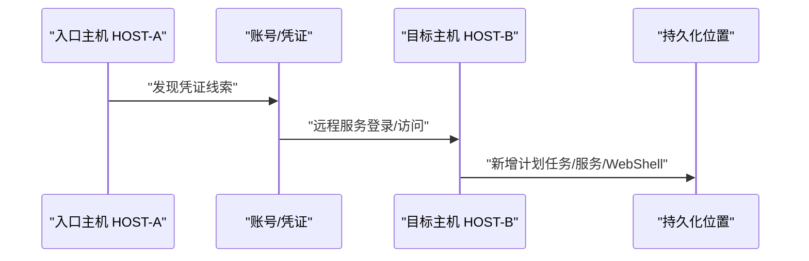

# 08. 内网横向 & 后渗透 & 权限维持

> 写作原则：本章按图中第 8 个板块整理，面向授权靶场、企业防守、应急响应和红队复盘。本章把“横向、凭证、C2、持久化”作为安全知识讲解，重点写证据链、检测点和防护，不提供真实环境入侵操作步骤。

## 1. 这个板块到底在干什么？

大白话：前面章节可能已经证明某台机器有问题。第 8 章关注的是：**攻击者拿到一台机器后，如何尝试访问更多机器、更多账号，并让访问长期存在；防守者如何发现和阻断。**

这个阶段常见链条：

```text
入口机器 → 凭证收集 → 账号复用 → 远程服务登录 → 横向移动 → 权限扩大 → 持久化 → 数据访问/外传
```

事实依据：

- MITRE ATT&CK 把 Credential Access、Lateral Movement、Persistence 分成独立战术。[^mitre-credential][^mitre-lateral][^mitre-persistence]
- CISA 的勒索软件和事件响应资料反复强调凭证、远程服务、持久化、日志审计的重要性。[^cisa-ransomware-guide]

---

## 2. 图中第 8 板块拆解

| 图中分类 | 图中工具/关键词 | 入门者理解 |
|---|---|---|
| 凭证抓取 | mimikatz（Windows 密码/哈希抓取） | 从内存、系统、缓存中获取账号凭证或哈希。 |
| 红队 C2 远控平台 | Cobalt_Strike_4.7（CS） | 合法授权攻防演练平台，也常被攻击者滥用。 |
| 内网横向移动工具 | goexec、ladon、gorailgun、alien | 用账号、远程服务、代理等访问更多内网主机。 |
| 持久化后门（权限驻守） | yongheng（计划任务/注册表/服务后门）、hearts（Windows 服务劫持持久化） | 让访问在重启、登出、清理后仍能恢复。 |

---

## 3. 凭证抓取：为什么一台机器会影响一片网络？

### 3.1 可核验工具事实

| 工具 | 可核验事实 | 来源 |
|---|---|---|
| Mimikatz | GitHub 项目存在，作者 Benjamin Delpy；安全社区常用其研究 Windows 凭证与认证机制。 | [gentilkiwi/mimikatz](https://github.com/gentilkiwi/mimikatz) |

MITRE T1003 “OS Credential Dumping” 描述了从操作系统获取凭证的技术，子技术包括 LSASS Memory。[^mitre-t1003][^mitre-t1003-001]

### 3.2 大白话理解

Windows 登录后，系统为了让你访问共享、远程服务、域资源，会在某些位置保留认证材料或可用于认证的派生材料。攻击者如果能读取这些材料，可能不需要知道明文密码，也能继续访问其他资源。

常见风险来源：

| 来源 | 风险 |
|---|---|
| LSASS 内存 | 可能包含凭证材料或认证派生材料。 |
| 浏览器/客户端保存密码 | 账号复用风险。 |
| 配置文件/脚本 | 明文账号密码。 |
| Kerberos 票据 | 域环境横向访问线索。 |
| 哈希/令牌 | 可能用于传递或重放认证。 |

### 3.3 防守重点

- 启用 Credential Guard 等凭证保护能力；
- 限制本地管理员数量；
- 不让域管理员登录普通终端；
- 监控 LSASS 异常访问；
- 关闭明文密码缓存；
- 管理员账号分层；
- 使用 LAPS/Windows LAPS 管理本地管理员密码。[^microsoft-laps]

---

## 4. C2 远控平台：合法演练工具也会被滥用

### 4.1 可核验工具事实

Cobalt Strike 官方将其定位为 adversary simulation / red team operations 软件。[^cobaltstrike]

大白话：C2 平台像演练中的“指挥台”，可以管理受控客户端、任务、回连、代理、日志。企业授权红队可以用它模拟真实攻击者；攻击者也可能滥用泄露或破解版工具。

### 4.2 防守看什么

| 线索 | 说明 |
|---|---|
| 周期性 beacon | 固定间隔向外连接。 |
| 可疑 JA3/JA4/TLS 指纹 | 某些 C2 框架有通信特征。 |
| 进程注入 | Beacon 可能注入其他进程。 |
| 异常父子进程 | Office/浏览器/服务进程启动脚本或命令。 |
| DNS/HTTP 异常 | 随机 URI、固定 User-Agent、异常 Header。 |
| 横向动作 | SMB/WMI/WinRM/PsExec 风格远程执行。 |

MITRE ATT&CK 的 Command and Control 战术可作为 C2 检测学习目录。[^mitre-c2]

---

## 5. 横向移动：从一台机器走到另一台机器

### 5.1 图中工具状态

| 工具 | 本章处理方式 |
|---|---|
| goexec | 同名/近名项目较多，本轮没有找到能唯一对应图片名称的稳定官方来源；不做功能断言。 |
| ladon | GitHub 上存在 k8gege/Ladon 项目，常见描述为内网渗透扫描/横向相关工具集合；版本和来源需核对。 | [k8gege/Ladon](https://github.com/k8gege/Ladon) |
| gorailgun | 本轮没有找到能唯一对应图片名称的稳定官方来源；不做功能断言。 |
| alien | 同名项目太多，本轮没有找到能唯一对应图片名称的稳定官方来源；不做功能断言。 |

### 5.2 常见横向技术

MITRE T1021 “Remote Services” 描述了通过远程服务进行横向移动的技术。[^mitre-t1021]

| 方式 | 大白话 | 防守证据 |
|---|---|---|
| SMB/Admin Share | 用管理员共享访问远程主机 | Windows 登录事件、文件写入、服务创建。 |
| WMI | 远程调用 Windows 管理接口 | WMI 事件、进程创建。 |
| WinRM | PowerShell 远程管理 | WinRM 日志、PowerShell 日志。 |
| RDP | 远程桌面登录 | 4624 登录类型、RDP 日志。 |
| SSH | Linux 远程登录 | auth.log、known_hosts、命令历史。 |
| 数据库跳板 | 用数据库账号访问其他系统 | 数据库审计日志、网络连接。 |

### 5.3 横向移动报告字段

```text
source_host: 已控制/已登录机器
source_user: 使用的账号
target_host: 目标机器
protocol: SMB/WMI/WinRM/RDP/SSH/DB
credential_source: 明文/哈希/票据/测试账号/授权账号
evidence: 日志路径、时间、事件 ID、截图
impact: 可访问资源范围
cleanup: 会话、服务、文件、账号清理
```

---

## 6. 持久化：重启后还能回来就是风险

### 6.1 图中工具状态

| 工具 | 本章处理方式 |
|---|---|
| yongheng | 图片备注为计划任务/注册表/服务后门，但本轮没有找到稳定官方来源；不做具体功能断言。 |
| hearts | 图片备注为 Windows 服务劫持持久化，但本轮没有找到稳定官方来源；不做具体功能断言。 |

### 6.2 常见持久化位置

| 持久化方式 | MITRE 技术 | 大白话 |
|---|---|---|
| 计划任务 | T1053 Scheduled Task/Job | 定时或开机运行。 |
| 注册表 Run Key | T1547.001 Registry Run Keys / Startup Folder | 用户登录时自动启动。 |
| Windows 服务 | T1543.003 Windows Service | 伪装成系统服务运行。 |
| WMI Event Subscription | T1546.003 WMI Event Subscription | 满足事件条件后触发执行。 |
| SSH authorized_keys | T1098 Account Manipulation 等相关 | 加入持久登录入口。 |
| WebShell 文件 | WebShell 持久入口 | Web 目录中保留控制脚本。 |

来源：MITRE ATT&CK 对这些技术均有独立条目。[^mitre-t1053][^mitre-t1547-001][^mitre-t1543-003][^mitre-t1546-003]

### 6.3 防守检查

```text
1. 新增服务：服务名、路径、创建时间、签名。
2. 新计划任务：触发器、执行文件、创建者。
3. 注册表启动项：Run/RunOnce/Services。
4. 新账号/新组成员：管理员组、远程桌面组。
5. SSH key：authorized_keys 新增项。
6. Web 目录：新脚本、新上传目录、异常修改时间。
7. EDR/日志：进程树和网络连接。
```

---

## 7. 真实案例

### 案例 1：Cobalt Strike 被攻击者滥用

Cobalt Strike 是合法红队工具，但多家官方安全通报和厂商分析都记录过攻击者滥用 Cobalt Strike 进行后渗透和 C2 通信。这个案例说明：**检测时不能只按“是否知名工具”判断好坏，要看授权、上下文、行为和日志。**[^cobaltstrike][^cisa-cobalt]

### 案例 2：Exchange 漏洞后部署 WebShell

Microsoft HAFNIUM 事件中，攻击者利用 Exchange Server 漏洞后部署 WebShell。这个案例说明：**持久化入口经常紧跟在漏洞利用之后，清理时不能只打补丁，还要查落地文件和账号行为。**[^microsoft-hafnium]

### 案例 3：凭证与远程服务在勒索事件中的作用

CISA 勒索软件指南强调 MFA、账户权限控制、日志审计和远程访问安全。这个案例说明：**横向移动不一定靠高深漏洞，弱凭证、复用密码、远程服务暴露同样危险。**[^cisa-ransomware-guide]

---

## 8. 入门练习：画一条后渗透时间线

在本地靶场或日志样本中，不执行危险动作，只整理证据：

```text
1. initial-access.md：入口时间、入口漏洞或账号。
2. credential-access.md：发现了哪些凭证线索，是否脱敏。
3. lateral-movement.md：从哪台机器到哪台机器，用了什么协议。
4. persistence.md：新增服务/计划任务/注册表/WebShell/账号。
5. cleanup.md：清理动作、补丁、密码轮换、日志保全。
```

Mermaid 时间线：



---

## 9. 防守检查清单

| 检查项 | 说明 |
|---|---|
| 凭证保护 | Credential Guard、LSASS 保护、本地管理员密码管理。 |
| 管理员分层 | 域管理员不登录普通终端。 |
| MFA | VPN、邮箱、云平台、堡垒机、管理后台强制 MFA。 |
| 横向协议审计 | SMB、WMI、WinRM、RDP、SSH 日志集中化。 |
| C2 行为检测 | 周期性 beacon、异常外联、可疑 TLS/HTTP 指纹。 |
| 持久化巡检 | 服务、计划任务、注册表、WMI、SSH key、Web 目录。 |
| 网络分段 | 普通终端不能随意访问服务器管理端口。 |
| 账号轮换 | 事件后重置密码、票据、Token、密钥。 |

---

## 10. 常见误区

| 误区 | 为什么错 | 正确做法 |
|---|---|---|
| 拿到一台机器就等于拿下内网 | 横向需要凭证、网络和权限条件 | 逐条记录可访问范围。 |
| 只查漏洞不查凭证 | 后渗透常靠凭证复用 | 查明文配置、票据、账号权限。 |
| 只删除 WebShell | 可能还有账号、服务、任务 | 按持久化清单全量排查。 |
| 只看工具名 | 工具可改名 | 看行为、网络、进程和日志。 |
| 不做时间线 | 很难判断攻击路径 | 把入口、凭证、横向、持久化串起来。 |

---

## 11. 本章来源

[^mitre-credential]: MITRE ATT&CK Credential Access: https://attack.mitre.org/tactics/TA0006/
[^mitre-lateral]: MITRE ATT&CK Lateral Movement: https://attack.mitre.org/tactics/TA0008/
[^mitre-persistence]: MITRE ATT&CK Persistence: https://attack.mitre.org/tactics/TA0003/
[^cisa-ransomware-guide]: CISA Stop Ransomware Guide: https://www.cisa.gov/stopransomware/ransomware-guide
[^mimikatz]: Mimikatz GitHub: https://github.com/gentilkiwi/mimikatz
[^mitre-t1003]: MITRE ATT&CK T1003 - OS Credential Dumping: https://attack.mitre.org/techniques/T1003/
[^mitre-t1003-001]: MITRE ATT&CK T1003.001 - LSASS Memory: https://attack.mitre.org/techniques/T1003/001/
[^microsoft-laps]: Microsoft Windows LAPS: https://learn.microsoft.com/en-us/windows-server/identity/laps/laps-overview
[^cobaltstrike]: Cobalt Strike official site: https://www.cobaltstrike.com/
[^mitre-c2]: MITRE ATT&CK Command and Control: https://attack.mitre.org/tactics/TA0011/
[^ladon]: Ladon GitHub: https://github.com/k8gege/Ladon
[^mitre-t1021]: MITRE ATT&CK T1021 - Remote Services: https://attack.mitre.org/techniques/T1021/
[^mitre-t1053]: MITRE ATT&CK T1053 - Scheduled Task/Job: https://attack.mitre.org/techniques/T1053/
[^mitre-t1547-001]: MITRE ATT&CK T1547.001 - Registry Run Keys / Startup Folder: https://attack.mitre.org/techniques/T1547/001/
[^mitre-t1543-003]: MITRE ATT&CK T1543.003 - Windows Service: https://attack.mitre.org/techniques/T1543/003/
[^mitre-t1546-003]: MITRE ATT&CK T1546.003 - WMI Event Subscription: https://attack.mitre.org/techniques/T1546/003/
[^cisa-cobalt]: CISA Malware Analysis Report MAR-10339794-1.v1 - Cobalt Strike Beacon: https://www.cisa.gov/news-events/analysis-reports/ar21-148a
[^microsoft-hafnium]: Microsoft, HAFNIUM targeting Exchange Servers: https://www.microsoft.com/en-us/security/blog/2021/03/02/hafnium-targeting-exchange-servers/
